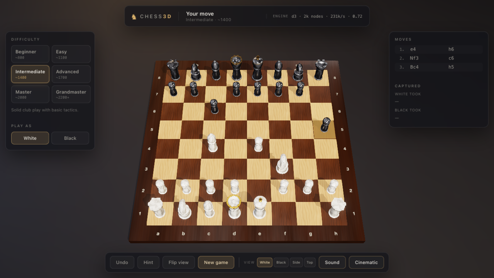

# Chess3D

A cinematic 3D chess game built with Three.js, played against an offline AI
opponent. The entire application is a static site: no server-side code, no API
calls, no network requests at runtime, and no external assets. Everything —
textures, geometry, sound effects and the chess engine itself — is generated or
computed in the browser.

**Play it now:** <https://shawt.im/chess3d/>



## Quick start

Because ES modules are blocked over `file://`, serve the directory over HTTP:

```bash
npm run serve          # http://localhost:4173
```

Any static host works. To deploy, publish the repository root as-is (see
[Deployment](#deployment)).

## Features

**Gameplay**
- Single-player against a built-in AI opponent, with six difficulty tiers from
  Beginner (~800) to Grandmaster (~2200+).
- Play as White or Black; the AI opens when you take Black.
- Full rules: castling, en passant, promotion (including underpromotion),
  check, checkmate, stalemate, the fifty-move rule, threefold repetition and
  insufficient material.
- Undo (takes back both your move and the AI's reply), a Hint button that
  suggests a strong move, and a move list in standard algebraic notation with
  captured-piece trays.

**Presentation**
- Procedurally generated Staunton pieces: the pawn, rook, bishop, queen and king
  are lathed from hand-tuned profiles; the knight's head is lofted along a
  curved spine.
- Procedural wood and marble textures with derived roughness and normal maps,
  lit by a three-point studio rig over a generated image-based environment.
- Physically based materials with clearcoat and sheen, soft shadows, ACES tone
  mapping, subtle bloom on the gold accents, a vignette and SMAA.
- Animated moves: pieces slide with a slight arc, knights leap and roll,
  captured pieces dissolve into dust, promotions pop.
- Synthesised sound effects (wooden knocks, chimes, check sting) via WebAudio.
- A phone layout that collapses both side panels into an on-demand sheet, so the
  board gets the screen; framing adapts to the viewport shape.
- Camera presets that solve their own framing against the live UI layout, so the
  whole board stays visible at any window size.

**Offline**
- The opponent is a real search engine computed in the browser, not a model
  called over the network. See [How the AI works](#how-the-ai-works--and-why-it-is-offline).
- Three.js is vendored into `vendor/three` and referenced through an import map.
- The AI runs in a Web Worker so the render loop never stutters while it thinks.
- No `fetch`, `XMLHttpRequest`, WebSocket or CDN reference exists in the source.

## Controls

| Input | Action |
| --- | --- |
| Click / tap a piece, then a destination | Move |
| Drag on the board | Orbit the camera |
| Scroll or pinch | Zoom |
| Tap **Menu** (phone) | Open difficulty, side, move list and captured pieces |
| `U` | Undo |
| `H` | Hint |
| `N` | New game |
| `F` | Flip sides |
| `1` `2` `3` `4` | White / Black / Side / Top view |
| `Esc` | Clear selection |

## Architecture

```
src/
  engine/      Pure chess logic, no rendering or DOM dependencies
    chess.js       Board, move generation, FEN, SAN, game-end detection
    evaluate.js    Static evaluation (material, piece-square tables, structure)
    ai.js          Negamax + alpha-beta, transposition table, quiescence
  render/      Three.js scene construction
    textures.js    Procedural canvas textures, roughness and normal maps
    materials.js   Shared PBR material library
    pieces.js      Lathed and lofted Staunton piece geometry
    board.js       Tiles, frame, coordinate labels, interaction overlays
    pieceViews.js  Piece meshes and every move/capture/promotion animation
    scene.js       Renderer, lighting, IBL environment, post-processing
    camera.js      Orbit controls and the framing solver
  ui/          DOM overlay (HUD, move list, captured trays, modals)
  audio/       Procedural WebAudio sound effects
  game/        Game controller: the single owner of game state
  worker/      AI Web Worker
```

The dependency rule is that `engine/` imports nothing outside itself. That is
what lets the AI run in a Worker (import maps do not apply inside workers, so the
worker may only use relative imports) and keeps the rules testable in plain Node.

State flows one way: the controller mutates the `Chess` instance, then calls into
the views and the HUD. Views are pure functions of state, which is why undo and
new-game are simply "change state, rebuild views" and can never desync.

## How the AI works — and why it is offline

The opponent is not a language model and not a remote service. It is a
conventional chess search engine: the same approach that has beaten human world
champions since 1997. Nothing about it needs a network connection, because
searching a game tree is arithmetic over data already in memory. The AI is
*computed*, not *queried*.

`src/engine/ai.js` is roughly 500 lines of plain JavaScript, in three parts.

### 1. Evaluation — "who is better here?"

`evaluate.js` scores any position in centipawns (100 = one pawn). Positive
favours White; the search negates the score as it descends.

| Term | What it captures |
| --- | --- |
| Material | Pawn 100, knight 320, bishop 335, rook 500, queen 950 |
| Piece-square tables | *Where* a piece stands — a knight in the centre is worth far more than one on the rim |
| Pawn structure | Doubled and isolated pawns |
| Bishop pair | Two bishops are worth more than the sum of their parts |
| Rooks | Bonus on open and semi-open files |
| King safety | A pawn shield in front of the king while the queens are on |
| King activity | A separate table for the endgame, where the king should march up the board |

Piece-square tables do most of the work. Instead of hand-writing dozens of
rules, one table per piece type encodes the principles directly, and each is a
single array lookup at evaluation time.

### 2. Search — "what happens if I look ahead?"

**Negamax with alpha-beta pruning.** The engine tries every move, assumes the
opponent replies with their best, tries every reply, and so on. Unpruned, the
branching factor is about 30, so six plies is 30^6 ~ 700 million positions —
hopeless.

Alpha-beta pruning fixes that. As soon as a branch is provably worse than a
choice already in hand, the whole branch is abandoned. In the best case this
cuts the work to roughly the square root, so six plies costs on the order of
30^3 nodes instead of 30^6.

On top of that:

- **Iterative deepening.** Search one ply, then two, then three. Each pass
  reorders moves using the previous pass's results, which makes pruning far more
  effective — and it means the engine can stop at any moment and still have a
  complete answer, which is what makes a wall-clock time limit possible.
- **Transposition table** (1M entries, Zobrist-hashed). Different move orders
  reach the same position; the table remembers what was already computed. Entries
  are tagged exact, lower bound or upper bound.
- **Quiescence search.** At the depth limit the engine does not simply stop — it
  keeps searching captures only, so it never misjudges a position mid-trade.
- **Check extension.** Being in check extends the search, so tactical sequences
  are not cut off partway.
- **Move ordering** by transposition-table move, MVV-LVA captures, promotions,
  killer moves and the history heuristic. Better ordering means better pruning.

### 3. Difficulty — six tiers

Each tier pairs a search budget with a little randomness, so the weaker bots
feel like a club player who makes mistakes rather than a shallow program:

| Tier | Depth | Time | Randomness | Blunder rate |
| --- | --- | --- | --- | --- |
| Beginner (~800) | 1 | 120 ms | 90 cp | 30% |
| Easy (~1100) | 2 | 250 ms | 55 cp | 16% |
| Intermediate (~1400) | 3 | 600 ms | 28 cp | 7% |
| Advanced (~1700) | 5 | 1200 ms | 12 cp | 2% |
| Master (~2000) | 7 | 2500 ms | 4 cp | 0% |
| Grandmaster (~2200+) | 12 | 5000 ms | 0 cp | 0% |

At the top tiers the engine searches roughly 90k–260k positions per second in
the browser.

### Why this fits in a static page

One architectural decision makes it work: **`src/engine/` imports nothing
outside itself.** It never touches Three.js, the DOM or `window`. It is pure
logic over a 64-entry array.

That unlocks two things.

**It can run in a Web Worker.** A deep search takes real time, and running it on
the main thread would freeze the render loop. The engine therefore lives in
`src/worker/aiWorker.js`. Note the trap here: *import maps do not apply inside a
worker*, so the worker may only use relative imports — the bare specifier
`three` that the page's import map resolves would fail there. Because the engine
has no Three.js dependency at all, this is not a problem.

**It can be tested in plain Node.** `tests/ai.test.mjs` runs without a browser,
which is how the engine's tactics and strength are verified (see
[Testing](#testing)).

So "offline" is not a degraded mode. Nothing is cached, stubbed or faked: the
engine plays exactly the same game with the network cable unplugged, because the
CPU was always the only thing it needed.

## Testing

```bash
npm test
```

Four suites run in plain Node:

- `tests/perft.test.mjs` — perft node counts against the published values for
  six standard positions (including Kiwipete and the en-passant/promotion stress
  positions) to depth 4-5, plus targeted rule tests for en passant, castling,
  pins, promotion, hash correctness and game-end detection.
- `tests/ai.test.mjs` — the engine must find forced mates and knight forks, must
  not hang material, must respect its time budget, must return legal moves in
  every test position, and must beat a random mover from the stronger tiers.
- `tests/geometry.test.mjs` — the generated pieces must be closed solids wound
  outward, reach their declared heights, overlap their pedestals, taper in three
  dimensions, and shade smoothly rather than faceted. These assertions caught
  three real bugs after visual review had already passed the same builds: an
  inward-wound knight head that back-face culling hid entirely, a non-indexed
  merge that flattened its shading, and ears seated inside the skull.
- `tests/capture.test.mjs` — the view layer, run headlessly against a stubbed
  canvas: a capture must remove the captured piece, not the capturing one.
- `tests/board.test.mjs` — the board's square colours, asserted against the rules
  of chess rather than against the implementation: a1 dark, h1 light, the queen on
  her own colour. This caught a real bug that had inverted every square for most of
  the project's life and survived repeated visual review, because nothing checked
  it and a rendered board looks plausible either way.
- `tests/seo.test.mjs` — the social and search metadata: absolute og:image URLs,
  a canonical matching the deployed host and subpath, structured data that parses,
  and every referenced icon present on disk.

### Inspecting the geometry

`tools/` carries a few small probes, handy when changing a piece:

| Tool | What it reports |
| --- | --- |
| `check-imports.mjs` | asserts every import under `src/` resolves |
| `knight_render.mjs` | the knight mesh as an ASCII side elevation |
| `shading_audit.mjs` | normal deviation per piece (0 deg = flat-shaded, >1 deg = smooth) |
| `mesh_audit.mjs` | signed volume and edge topology per piece (winding, watertightness) |


### Checking mobile layout

`tools/dev/mobile-harness.html` runs the app inside an iframe at real device
sizes, one at a time (`?only=ip14`), and reports the projected board rect, the
panel rects, and the on-screen size of one board square. It exists because the
mobile layout cannot be judged by eye — the failures it found were numbers:
the board overflowing by 29px, panels overlapping it, and a square 21.9px across.

```bash
npm run serve   # then open /tools/dev/mobile-harness.html?only=ip14
```

Measured square sizes, all five viewports with zero overflow and no panel overlap:

| Device | Square |
| --- | --- |
| iPhone SE 375x667 | 36.2px |
| iPhone 14 390x844 | 39.4px |
| Pixel 7 412x915 | 42.7px |
| iPad mini 744x1133 | 74.4px |
| iPhone landscape 844x390 | 26.6px (81.8px after pinch) |

Landscape stays smaller because the space between the bars is only 276px of a
390px screen — that is geometry, not a defect. Pinch-zoom is the answer there, and
the camera also tilts towards top-down on short wide viewports so the squares
project as large as the band allows.

## Deployment

The app is static files, so any static host works: GitHub Pages, Netlify,
Cloudflare Pages, S3, nginx. There is no build step.

**Live:** <https://shawt.im/chess3d/>

### What to publish

Everything except the development-only paths:

| Path | Why it ships |
| --- | --- |
| `index.html` | the page, including all SEO and social metadata |
| `styles.css` | the UI styling |
| `src/` | the engine, renderer, HUD and AI worker |
| `vendor/` | Three.js, vendored so nothing loads from a CDN |
| `docs/` | the social card, app icons and README screenshot |
| `robots.txt` | crawler policy and sitemap pointer |
| `sitemap.xml` | the single URL, for search engines |
| `site.webmanifest` | app name, icons and theme colour for install |
| `.nojekyll` | **required on GitHub Pages** — without it Jekyll processing can drop files |

Development-only, safe to exclude: `node_modules/`, `tests/`, `tools/`,
`package.json`, `package-lock.json`.

### Host requirements

Two things must be true of the host, and both are worth checking because they
fail in ways that are easy to miss:

1. **`.js` must be served with a JavaScript MIME type.** The page uses a module
   worker, and a wrong content type stops the AI worker loading. Every common
   static host does this correctly.
2. **The site may live under a subpath.** All asset paths are relative and the
   import map points at `./vendor/...`, so the app works at `/chess3d/` as well
   as at a domain root. The absolute URLs in `index.html` (canonical, `og:image`,
   sitemap) are the one place a subpath is hard-coded — update those four values
   if you host it somewhere else.

### GitHub Pages

Publish the repository root from the `main` branch. `.nojekyll` is already
committed. If you use a custom domain, set it in the repository's Pages settings
and add a `CNAME` file containing the domain.

### Social previews

`docs/og-image.png` (1200x630) is referenced by absolute URL, and `og:image`
points at it. After changing it, re-scrape the URL with the
[Facebook Sharing Debugger](https://developers.facebook.com/tools/debug/) or the
[Twitter Card Validator](https://cards-dev.twitter.com/validator) to clear the
cached preview. `npm test` includes `tests/seo.test.mjs`, which fails if the
image goes missing or the URLs drift from the deployed origin.

### Regenerating the images

```bash
python3 tools/make-social-images.py   # needs Pillow and docs/hero-render.png
```

The script composes the card from a captured 3D render, so it can be rebuilt at
any time rather than being a hand-edited binary.

## Browser support

Needs WebGL2 and ES module workers: current Chrome, Edge, Firefox and Safari.

## Licence

Three.js is bundled under the MIT licence; see `vendor/three/LICENSE`.
